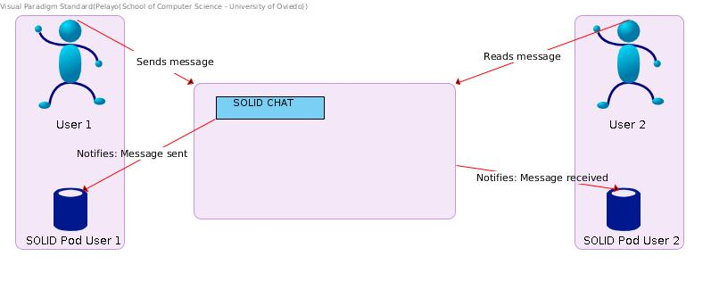

[[section-system-scope-and-context]]
== System Scope and Context

We'll take a look at how our chat interacts with everyone involved, as well as with all the techonologies we are going to use.

=== Business Context

|===
|*Participant*|*Action*
| User 1 | Sends message to the app.
| SOLID Pod User 1 | Stores the message sent, so only User 1 can read it.
| User 2 | Reads the message from the app.
| Solid Pod User 2 | Stores the message received, so he can read it through the whole conversation.
|===

=== Technical Context

image::./images/Deployment Diagram1.jpg[Deployment Diagram]

Our application will be deployed using https://www.docker.com/why-docker[Docker] and https://www.heroku.com/[Heroku]. The application itself can be seen as two main artifacts: On one hand, the login using POD identifiers. On the other hand, the shared messages between the members of the chat.

