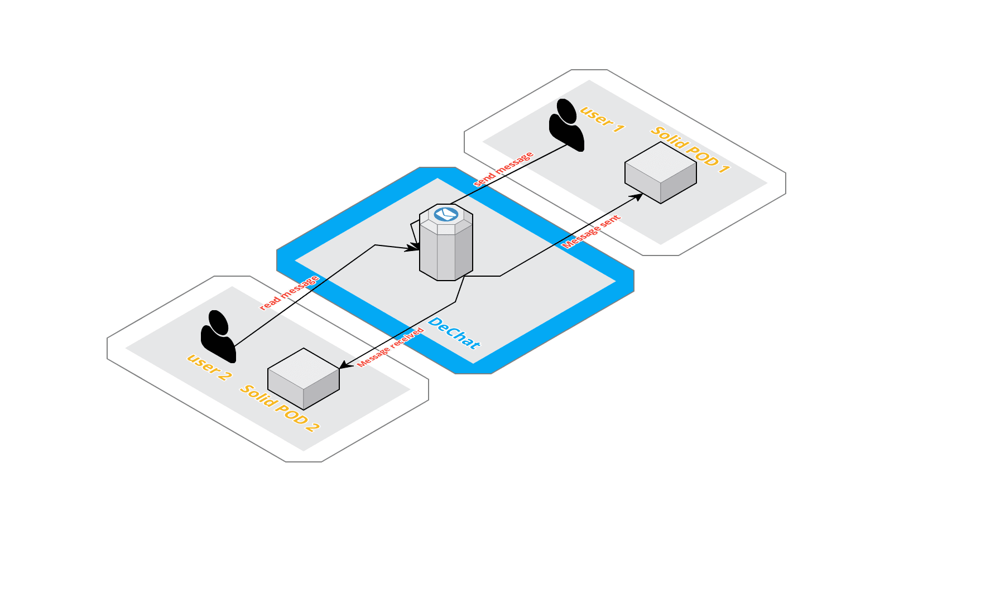
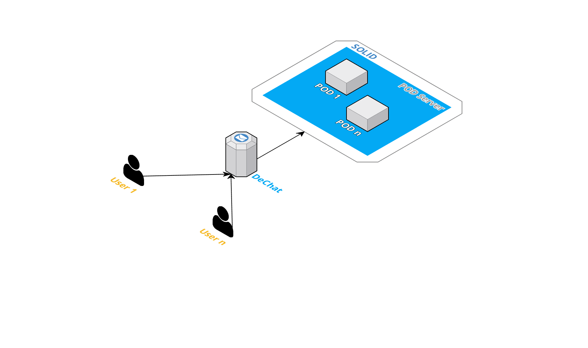

[[section-system-scope-and-context]]
== System Scope and Context

Decentralization has nowadays many limitations, although it provides more privacy and security while treating personal data.

These limitations are narrowed down to the PODs own limitations, as communication relies on their use.

Interaction only needs three main parts: application, user and POD. The application manages the storage of information in the PODs
while users exchange that same info in a private way, that is deciding who should be able to view that stored data.

=== Business Context

|===
|*Participant*|*Action*
| P1. User 1 | Sends message to User 2 through the app.
| P2. SOLID Pod User 1 | Stores the message sent, so only User 1 can read it.
| P3. User 2 | Reads the message from the app.
| P4. Solid Pod User 2 | Stores the message received, so he can read it through the whole conversation.
|===

=== Technical Context

DeChat is a web based application which relies on the foundation of decentralization. For this to be reached, all data is stored in
the users' PODs.

Users will send messages through the chat using POD URLs, meaning it must be connected to the internet.

|===
|*Object*|*Description*
| O1. User | Represents the users of the chat.
| O2. DeChat | Decentralized and web based application.
| O3. POD | Individual storage unit for one user.
| O4. POD Server | Server provided by SOLID in which PODs are stored.
| O5. SOLID | New web ecosystem.
|===

