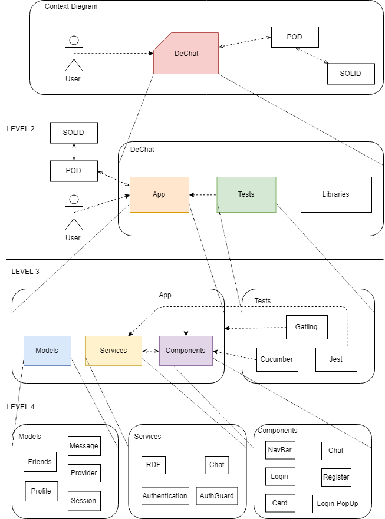

[[section-building-block-view]]

== Building Block View

=== Whitebox Overall System

Level 1 - Context Diagram::

Main schema of the architecture.

[cols="1,2" options="header"]
|===
| **Name** | **Responsibility**
| User | Person who is using the app.
| DeChat | Decentraliced web application.
| SOLID |  Solid PODs provider. Stores PODs.
| POD | Storage that contains all user's data.
|===

Level 2::

Zoom in the main parts of the application.

[cols="1,2" options="header"]
|===
| **Name** | **Responsibility**
| App | Decentralized chat.
| Tests | unit, acceptance and load testing.
| Libraries | External libraries being used.
|===

Level 3::

Specific parts of the application and different types of tests.

[cols="1,2" options="header"]
|===
| **Name** | **Responsibility**
| Models | Mapping classes present in the code.
| Components | Different components integrated in the application.
| Services | Services being used in the app for it to work properly.
| Cucumber | Unit testing.
| Jest | Acceptance testing.
| Gatling | Load testing.
|===

Level 4::

For the app to be able to send messages in a proper way, models, services and components are needed. In this app the
models used where those relating to the main functionality of the app (profile, session, message, friends and SOLID provider).

The main services used are RDF for storing the messages in the POD, Authentication and AuthGuard for login and registration purposes
and chat service, where all the code for interacting with the previous libraries is written.

A component for each different view of the application is needed.
