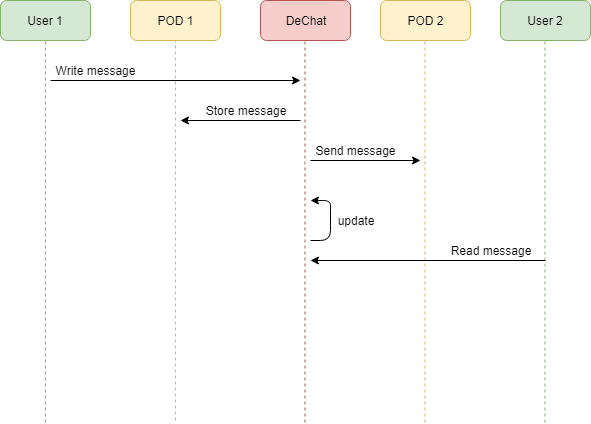

[[section-runtime-view]]
== Runtime View

When a conversation starts for the first time, a new folder with a new turtle file is created in the user's POD.

The user sends the message through the chat, and the
application stores the message in the user's own POD writing it on the turtle file in ttl format. While writing it, the message is sent to the
other user's POD also in ttl format.

Once both PODs have the data stored, the app runs an update and takes the data present in the turtle file and
prints it down on the chat view, so the receiver can read the message.

The messages are stored with all the information relevant to them: date, hour, sender, receiver, and message content.
