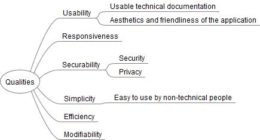

[[section-quality-scenarios]]
== Quality Requirements

This section contains a quality tree with scenarios, in order to understand the central quality goals (described in section 1.2.) as well as other required quality characteristics.

=== Quality Tree

=== Quality Scenarios

[width="100%",cols="34%,33%,33%",]
|===
|[.SpellE]#Nr#. |[.SpellE]#Quality# |[.SpellE]#Scenario#

|1 |[.SpellE]#Usability# |Each section of the technical documentation
must be understood by itself without the need to read the rest of the
documentation. Any content should be found immediately in the
documentation

|2 |[.SpellE]#Responsiveness# |Once completed, the application must pass
the Google Responsiveness Test
(https://search.google.com/test/mobile-friendly)

|3 |[.SpellE]#Securability# |A third party will not be allowed to access
the data transmitted between two users in a chat session.

|4 |[.SpellE]#Simplicity# |A non-technical user who has never used the
application should be able to open a chat session with another user in
less than 3 minutes.

|5 |[.SpellE]#Efficiency# |When sending a message through the chat, it
will be received by the recipient in less than 3s

|6 |[.SpellE]#Modifiability# |[.SpellE]#The application should have a 
correct design so that the modifications that must be made during the 
project can be addressed by the team in less than a week of work.#
|===

